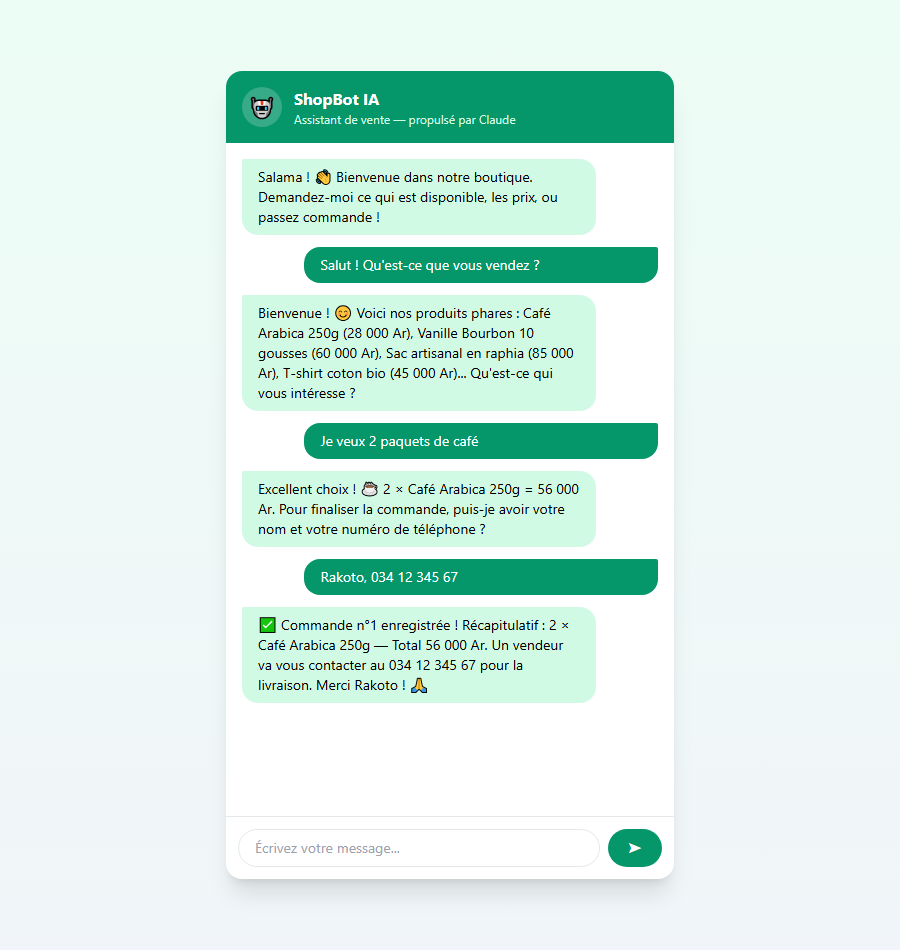

# inspiration et teste ShopBot IA  🤖
— Chatbot de vente pour commerces comme (Claude AI)

**FR** — Assistant de vente intelligent qui répond aux clients 24h/24 : présente le catalogue, donne les prix, prend les commandes. Fonctionne sur le **web** et via **webhook WhatsApp Business**.

**EN** — AI sales assistant that answers customers 24/7: shows the catalog, quotes prices, takes orders. Works on the **web** and through a **WhatsApp Business webhook**.

---

##  Ce qu'il fait

-  **Conversation naturelle** en français ou malgache, streaming token par token
-  **Catalogue en direct** : l'IA utilise des *outils* (function calling) — elle ne peut pas inventer de produits ni de prix
-  **Prise de commande** : vérifie le stock, enregistre la commande, confirme le récapitulatif
-  **Webhook WhatsApp Business** prêt à brancher (vérification Meta + réception des messages)
-  **Prompt caching** activé sur le system prompt (réduit les coûts jusqu'à 90 %)
-  **Testé** (pytest, sans clé API nécessaire) et **Dockerisé**

##  Aperçu

Exemple de parcours complet — découverte du catalogue → commande → confirmation :

  

Ouvrez http://localhost:8000 et discutez avec le bot : *« Qu'est-ce que vous vendez ? »*, *« Je veux 2 paquets de café »*...

| Composant | Techno |
|---|---|
| LLM | Claude Opus 4.8 (SDK officiel `anthropic`) |
| Function calling | Boucle d'outils avec streaming |
| API | FastAPI + StreamingResponse |
| WhatsApp | Webhook Meta Graph API |
| CI | GitHub Actions |

##  idee de Brancher WhatsApp Business

1. Créez une app sur [developers.facebook.com](https://developers.facebook.com) avec le produit WhatsApp
2. Configurez le webhook : URL `https://votre-domaine/webhook/whatsapp`, token = `WHATSAPP_VERIFY_TOKEN`
3. Abonnez-vous au champ `messages` — le bot répond automatiquement

---

##  Vous voulez un chatbot pour votre business ?

Je crée des assistants IA sur mesure (WhatsApp, Messenger, site web) connectés à votre catalogue, votre CRM ou vos outils.

**Joel Stephen** — Développeur  [github.com/Stephen077j](https://github.com/Stephen077j)
